# CÁC SƠ ĐỒ MERMAID CHO CHƯƠNG 3

## 1. USE CASE DIAGRAMS

### Hình 3.1. Sơ đồ ca sử dụng của Admin

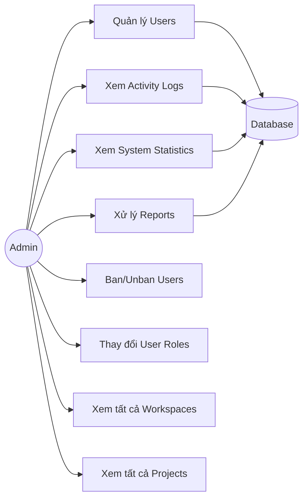
```mermaid
graph LR
    Admin((Admin))
    
    Admin --> UC1[Quản lý Users]
    Admin --> UC2[Xem Activity Logs]
    Admin --> UC3[Xem System Statistics]
    Admin --> UC4[Xử lý Reports]
    Admin --> UC5[Ban/Unban Users]
    Admin --> UC6[Thay đổi User Roles]
    Admin --> UC7[Xem tất cả Workspaces]
    Admin --> UC8[Xem tất cả Projects]
    
    UC1 --> System[(Database)]
    UC2 --> System
    UC3 --> System
    UC4 --> System
```

### Hình 3.2. Sơ đồ ca sử dụng của User

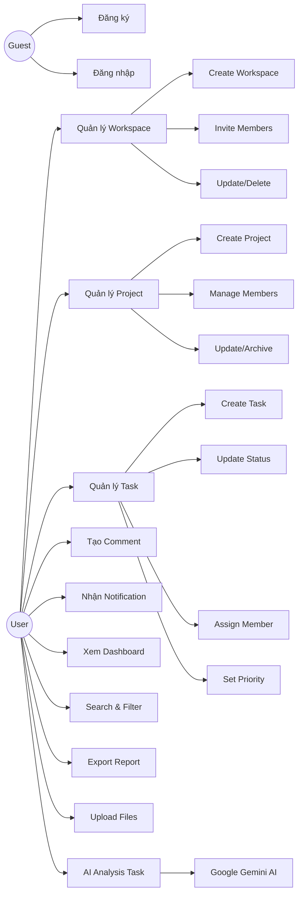
```mermaid
graph LR
    User((User))
    Guest((Guest))
    
    Guest --> UC1[Đăng ký]
    Guest --> UC2[Đăng nhập]
    
    User --> UC3[Quản lý Workspace]
    User --> UC4[Quản lý Project]
    User --> UC5[Quản lý Task]
    User --> UC6[Tạo Comment]
    User --> UC7[Nhận Notification]
    User --> UC8[Xem Dashboard]
    User --> UC9[Search & Filter]
    User --> UC10[Export Report]
    User --> UC11[Upload Files]
    User --> UC12[AI Analysis Task]
    
    UC3 --> UC3a[Create Workspace]
    UC3 --> UC3b[Invite Members]
    UC3 --> UC3c[Update/Delete]
    
    UC4 --> UC4a[Create Project]
    UC4 --> UC4b[Manage Members]
    UC4 --> UC4c[Update/Archive]
    
    UC5 --> UC5a[Create Task]
    UC5 --> UC5b[Update Status]
    UC5 --> UC5c[Assign Member]
    UC5 --> UC5d[Set Priority]
    
    UC12 --> AI[Google Gemini AI]
```

## 2. SEQUENCE DIAGRAMS

### Hình 3.3. Sơ đồ tuần tự - Đăng ký người dùng

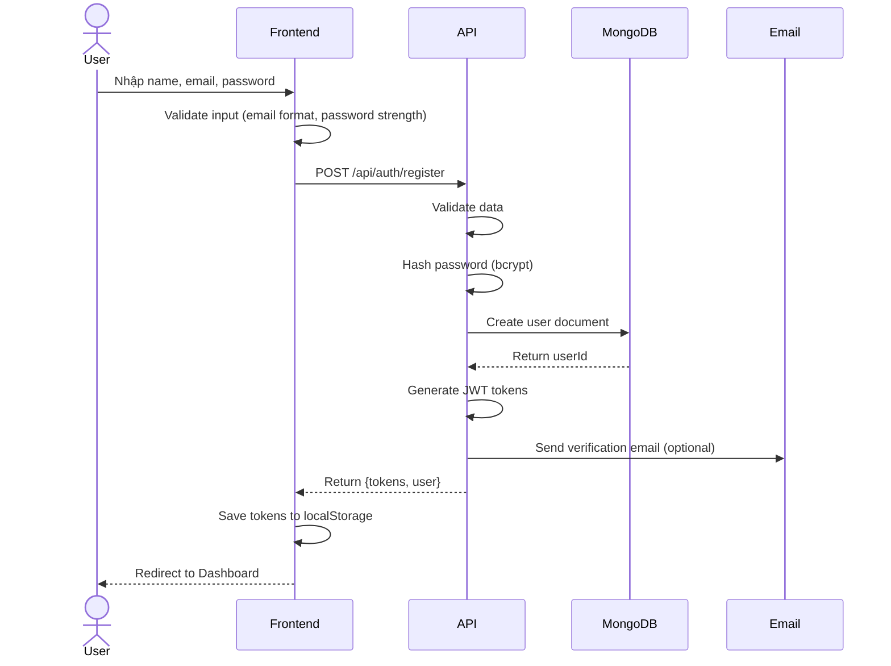
```mermaid
sequenceDiagram
    actor User
    participant Frontend
    participant API
    participant MongoDB
    participant Email
    
    User->>Frontend: Nhập name, email, password
    Frontend->>Frontend: Validate input (email format, password strength)
    Frontend->>API: POST /api/auth/register
    API->>API: Validate data
    API->>API: Hash password (bcrypt)
    API->>MongoDB: Create user document
    MongoDB-->>API: Return userId
    API->>API: Generate JWT tokens
    API->>Email: Send verification email (optional)
    API-->>Frontend: Return {tokens, user}
    Frontend->>Frontend: Save tokens to localStorage
    Frontend-->>User: Redirect to Dashboard
```

### Hình 3.4. Sơ đồ tuần tự - Đăng nhập

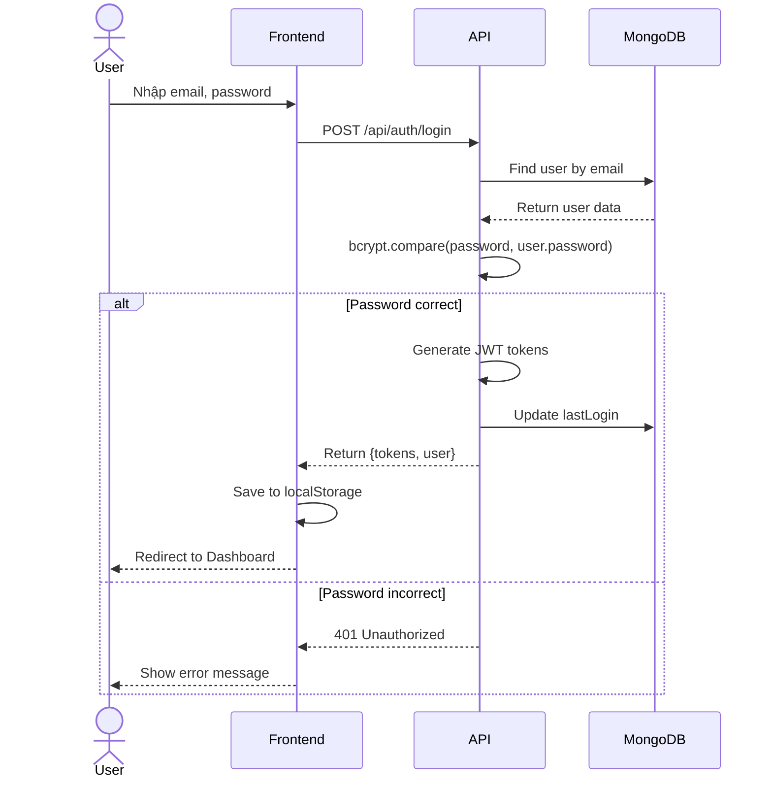
```mermaid
sequenceDiagram
    actor User
    participant Frontend
    participant API
    participant MongoDB
    
    User->>Frontend: Nhập email, password
    Frontend->>API: POST /api/auth/login
    API->>MongoDB: Find user by email
    MongoDB-->>API: Return user data
    API->>API: bcrypt.compare(password, user.password)
    
    alt Password correct
        API->>API: Generate JWT tokens
        API->>MongoDB: Update lastLogin
        API-->>Frontend: Return {tokens, user}
        Frontend->>Frontend: Save to localStorage
        Frontend-->>User: Redirect to Dashboard
    else Password incorrect
        API-->>Frontend: 401 Unauthorized
        Frontend-->>User: Show error message
    end
```

### Hình 3.5. Sơ đồ tuần tự - Đăng nhập Google OAuth

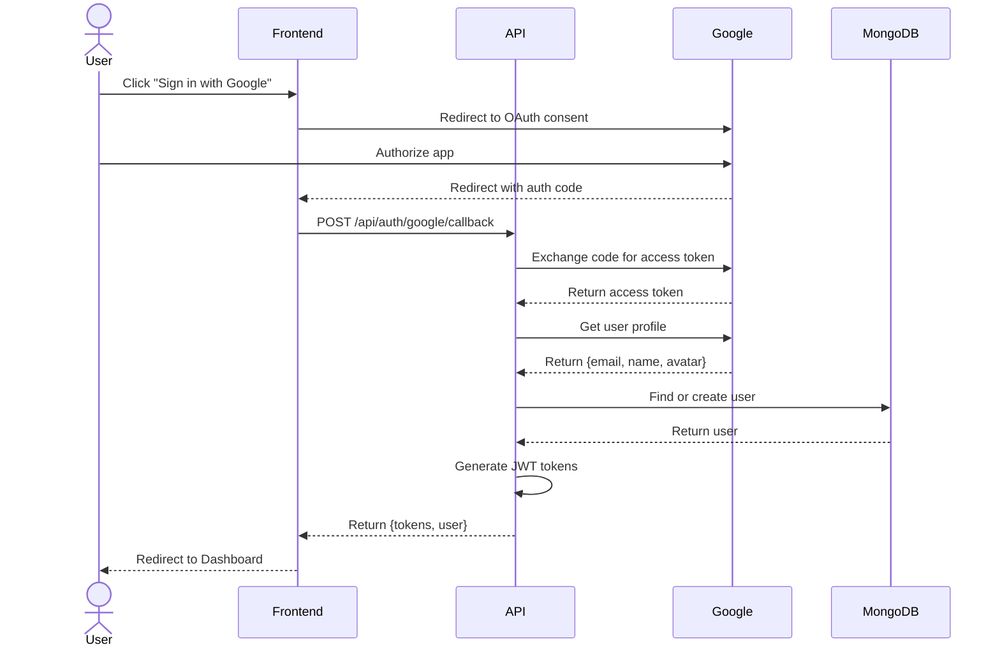
```mermaid
sequenceDiagram
    actor User
    participant Frontend
    participant API
    participant Google
    participant MongoDB
    
    User->>Frontend: Click "Sign in with Google"
    Frontend->>Google: Redirect to OAuth consent
    User->>Google: Authorize app
    Google-->>Frontend: Redirect with auth code
    Frontend->>API: POST /api/auth/google/callback
    API->>Google: Exchange code for access token
    Google-->>API: Return access token
    API->>Google: Get user profile
    Google-->>API: Return {email, name, avatar}
    API->>MongoDB: Find or create user
    MongoDB-->>API: Return user
    API->>API: Generate JWT tokens
    API-->>Frontend: Return {tokens, user}
    Frontend-->>User: Redirect to Dashboard
```

### Hình 3.6. Sơ đồ tuần tự - Đăng xuất

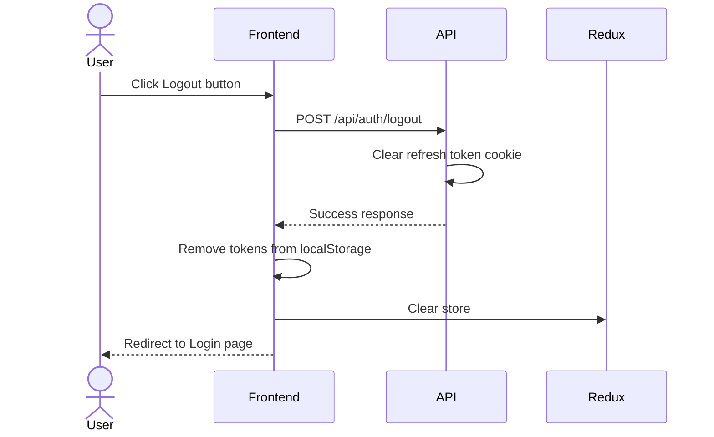
```mermaid
sequenceDiagram
    actor User
    participant Frontend
    participant API
    participant Redux
    
    User->>Frontend: Click Logout button
    Frontend->>API: POST /api/auth/logout
    API->>API: Clear refresh token cookie
    API-->>Frontend: Success response
    Frontend->>Frontend: Remove tokens from localStorage
    Frontend->>Redux: Clear store
    Frontend-->>User: Redirect to Login page
```

### Hình 3.7. Sơ đồ tuần tự - Quản lý Workspace

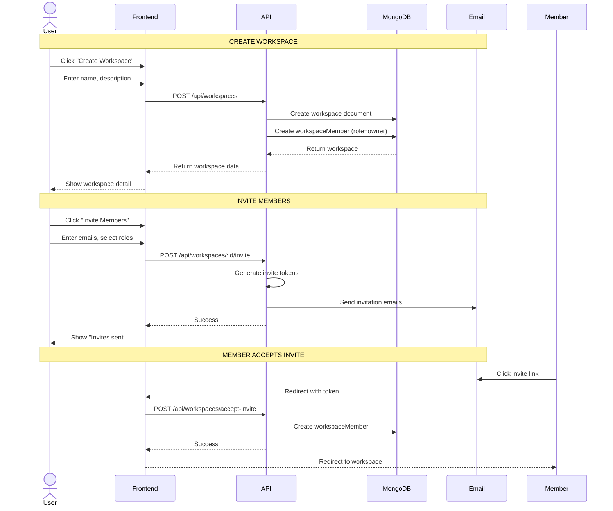
```mermaid
sequenceDiagram
    actor User
    participant Frontend
    participant API
    participant MongoDB
    participant Email
    
    Note over User,Email: CREATE WORKSPACE
    User->>Frontend: Click "Create Workspace"
    User->>Frontend: Enter name, description
    Frontend->>API: POST /api/workspaces
    API->>MongoDB: Create workspace document
    API->>MongoDB: Create workspaceMember (role=owner)
    MongoDB-->>API: Return workspace
    API-->>Frontend: Return workspace data
    Frontend-->>User: Show workspace detail
    
    Note over User,Email: INVITE MEMBERS
    User->>Frontend: Click "Invite Members"
    User->>Frontend: Enter emails, select roles
    Frontend->>API: POST /api/workspaces/:id/invite
    API->>API: Generate invite tokens
    API->>Email: Send invitation emails
    API-->>Frontend: Success
    Frontend-->>User: Show "Invites sent"
    
    Note over User,Email: MEMBER ACCEPTS INVITE
    participant Member
    Member->>Email: Click invite link
    Email->>Frontend: Redirect with token
    Frontend->>API: POST /api/workspaces/accept-invite
    API->>MongoDB: Create workspaceMember
    API-->>Frontend: Success
    Frontend-->>Member: Redirect to workspace
```

### Hình 3.8. Sơ đồ tuần tự - Quản lý Project

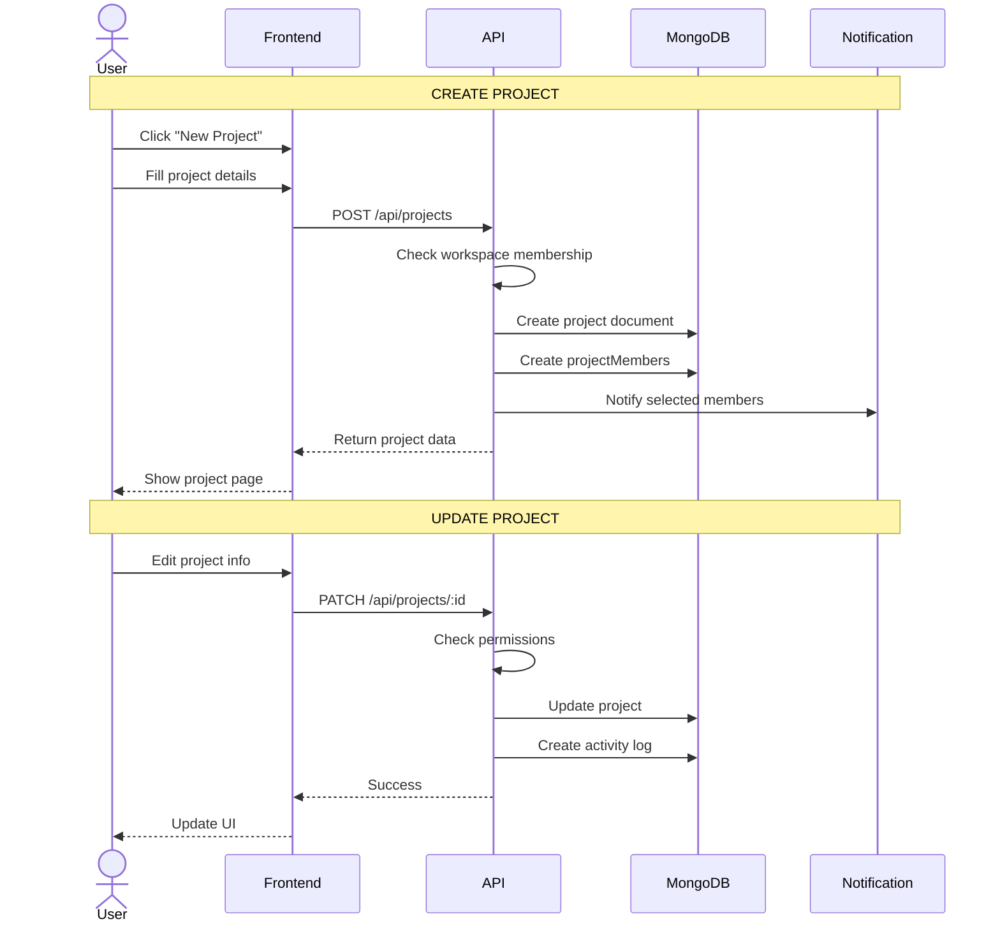
```mermaid
sequenceDiagram
    actor User
    participant Frontend
    participant API
    participant MongoDB
    participant Notification
    
    Note over User,Notification: CREATE PROJECT
    User->>Frontend: Click "New Project"
    User->>Frontend: Fill project details
    Frontend->>API: POST /api/projects
    API->>API: Check workspace membership
    API->>MongoDB: Create project document
    API->>MongoDB: Create projectMembers
    API->>Notification: Notify selected members
    API-->>Frontend: Return project data
    Frontend-->>User: Show project page
    
    Note over User,Notification: UPDATE PROJECT
    User->>Frontend: Edit project info
    Frontend->>API: PATCH /api/projects/:id
    API->>API: Check permissions
    API->>MongoDB: Update project
    API->>MongoDB: Create activity log
    API-->>Frontend: Success
    Frontend-->>User: Update UI
```

### Hình 3.9. Sơ đồ tuần tự - Quản lý Task

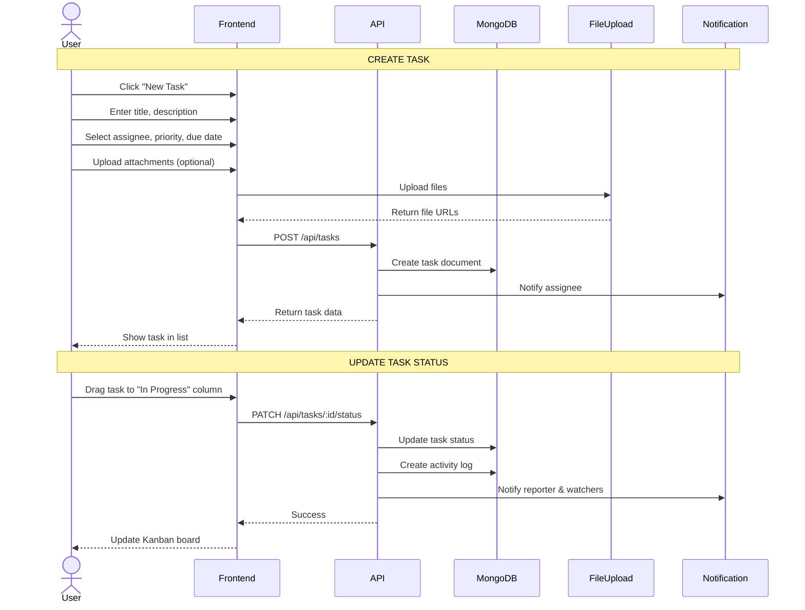
```mermaid
sequenceDiagram
    actor User
    participant Frontend
    participant API
    participant MongoDB
    participant FileUpload
    participant Notification
    
    Note over User,Notification: CREATE TASK
    User->>Frontend: Click "New Task"
    User->>Frontend: Enter title, description
    User->>Frontend: Select assignee, priority, due date
    User->>Frontend: Upload attachments (optional)
    Frontend->>FileUpload: Upload files
    FileUpload-->>Frontend: Return file URLs
    Frontend->>API: POST /api/tasks
    API->>MongoDB: Create task document
    API->>Notification: Notify assignee
    API-->>Frontend: Return task data
    Frontend-->>User: Show task in list
    
    Note over User,Notification: UPDATE TASK STATUS
    User->>Frontend: Drag task to "In Progress" column
    Frontend->>API: PATCH /api/tasks/:id/status
    API->>MongoDB: Update task status
    API->>MongoDB: Create activity log
    API->>Notification: Notify reporter & watchers
    API-->>Frontend: Success
    Frontend-->>User: Update Kanban board
```

### Hình 3.10. Sơ đồ tuần tự - AI phân tích Task

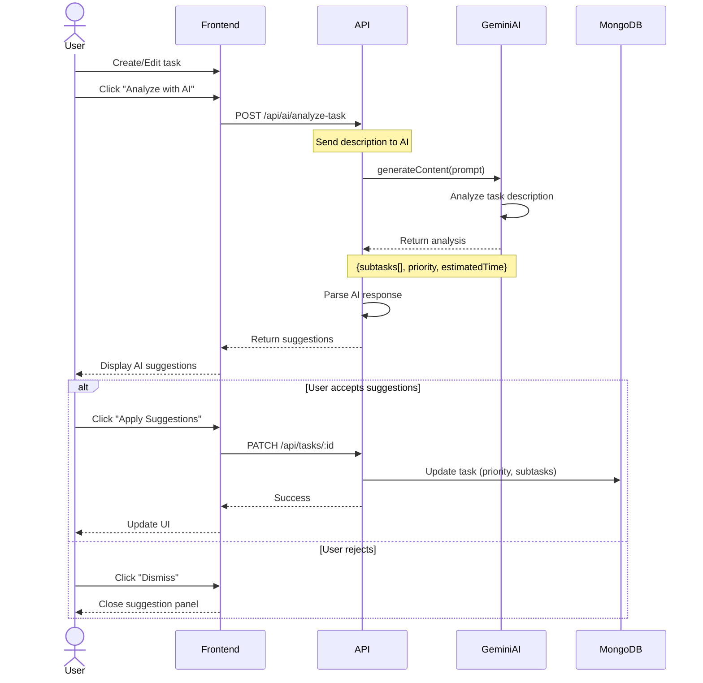
```mermaid
sequenceDiagram
    actor User
    participant Frontend
    participant API
    participant GeminiAI
    participant MongoDB
    
    User->>Frontend: Create/Edit task
    User->>Frontend: Click "Analyze with AI"
    Frontend->>API: POST /api/ai/analyze-task
    Note over API: Send description to AI
    API->>GeminiAI: generateContent(prompt)
    GeminiAI->>GeminiAI: Analyze task description
    GeminiAI-->>API: Return analysis
    Note over GeminiAI,API: {subtasks[], priority, estimatedTime}
    API->>API: Parse AI response
    API-->>Frontend: Return suggestions
    Frontend-->>User: Display AI suggestions
    
    alt User accepts suggestions
        User->>Frontend: Click "Apply Suggestions"
        Frontend->>API: PATCH /api/tasks/:id
        API->>MongoDB: Update task (priority, subtasks)
        API-->>Frontend: Success
        Frontend-->>User: Update UI
    else User rejects
        User->>Frontend: Click "Dismiss"
        Frontend-->>User: Close suggestion panel
    end
```

### Hình 3.11. Sơ đồ tuần tự - Comment và Discussion

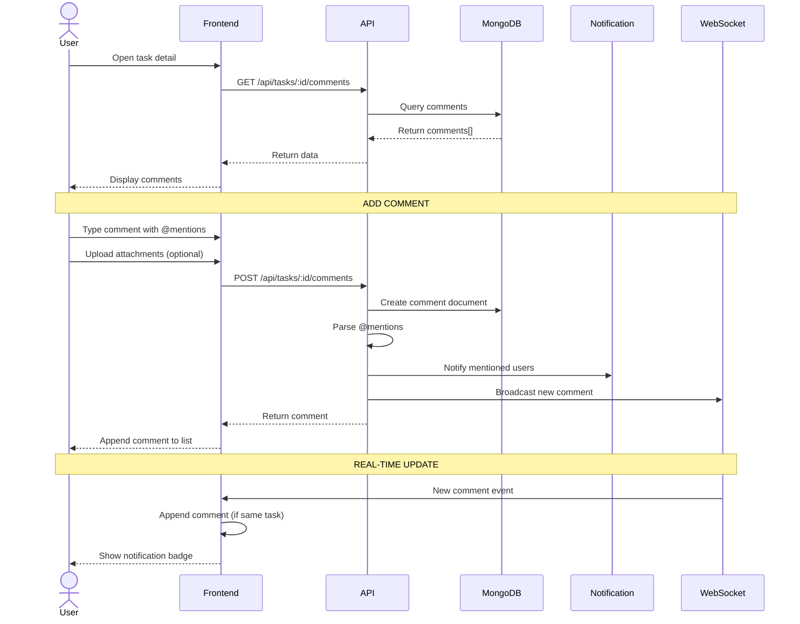
```mermaid
sequenceDiagram
    actor User
    participant Frontend
    participant API
    participant MongoDB
    participant Notification
    participant WebSocket
    
    User->>Frontend: Open task detail
    Frontend->>API: GET /api/tasks/:id/comments
    API->>MongoDB: Query comments
    MongoDB-->>API: Return comments[]
    API-->>Frontend: Return data
    Frontend-->>User: Display comments
    
    Note over User,WebSocket: ADD COMMENT
    User->>Frontend: Type comment with @mentions
    User->>Frontend: Upload attachments (optional)
    Frontend->>API: POST /api/tasks/:id/comments
    API->>MongoDB: Create comment document
    API->>API: Parse @mentions
    API->>Notification: Notify mentioned users
    API->>WebSocket: Broadcast new comment
    API-->>Frontend: Return comment
    Frontend-->>User: Append comment to list
    
    Note over User,WebSocket: REAL-TIME UPDATE
    WebSocket->>Frontend: New comment event
    Frontend->>Frontend: Append comment (if same task)
    Frontend-->>User: Show notification badge
```

### Hình 3.12. Sơ đồ tuần tự - Dashboard và Statistics

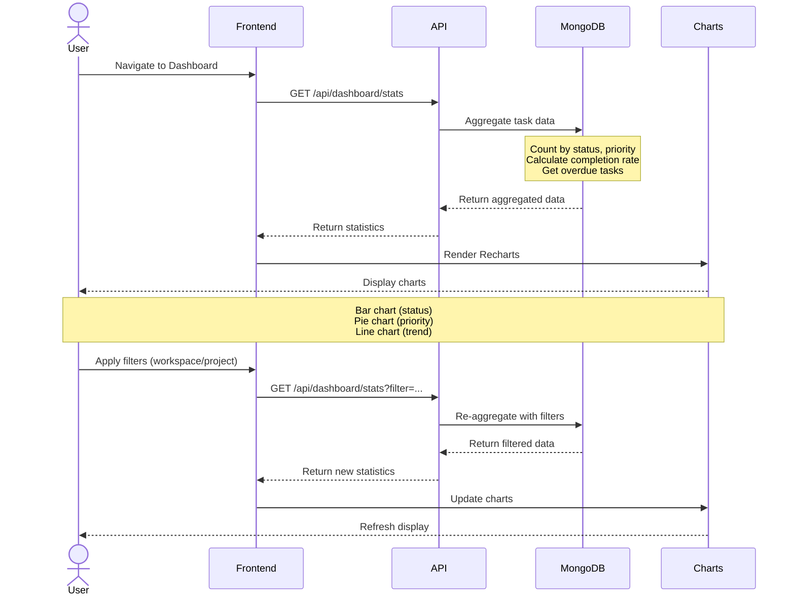
```mermaid
sequenceDiagram
    actor User
    participant Frontend
    participant API
    participant MongoDB
    participant Charts
    
    User->>Frontend: Navigate to Dashboard
    Frontend->>API: GET /api/dashboard/stats
    API->>MongoDB: Aggregate task data
    Note over MongoDB: Count by status, priority<br/>Calculate completion rate<br/>Get overdue tasks
    MongoDB-->>API: Return aggregated data
    API-->>Frontend: Return statistics
    Frontend->>Charts: Render Recharts
    Charts-->>User: Display charts
    Note over Charts,User: Bar chart (status)<br/>Pie chart (priority)<br/>Line chart (trend)
    
    User->>Frontend: Apply filters (workspace/project)
    Frontend->>API: GET /api/dashboard/stats?filter=...
    API->>MongoDB: Re-aggregate with filters
    MongoDB-->>API: Return filtered data
    API-->>Frontend: Return new statistics
    Frontend->>Charts: Update charts
    Charts-->>User: Refresh display
```

### Hình 3.13. Sơ đồ tuần tự - Notification System

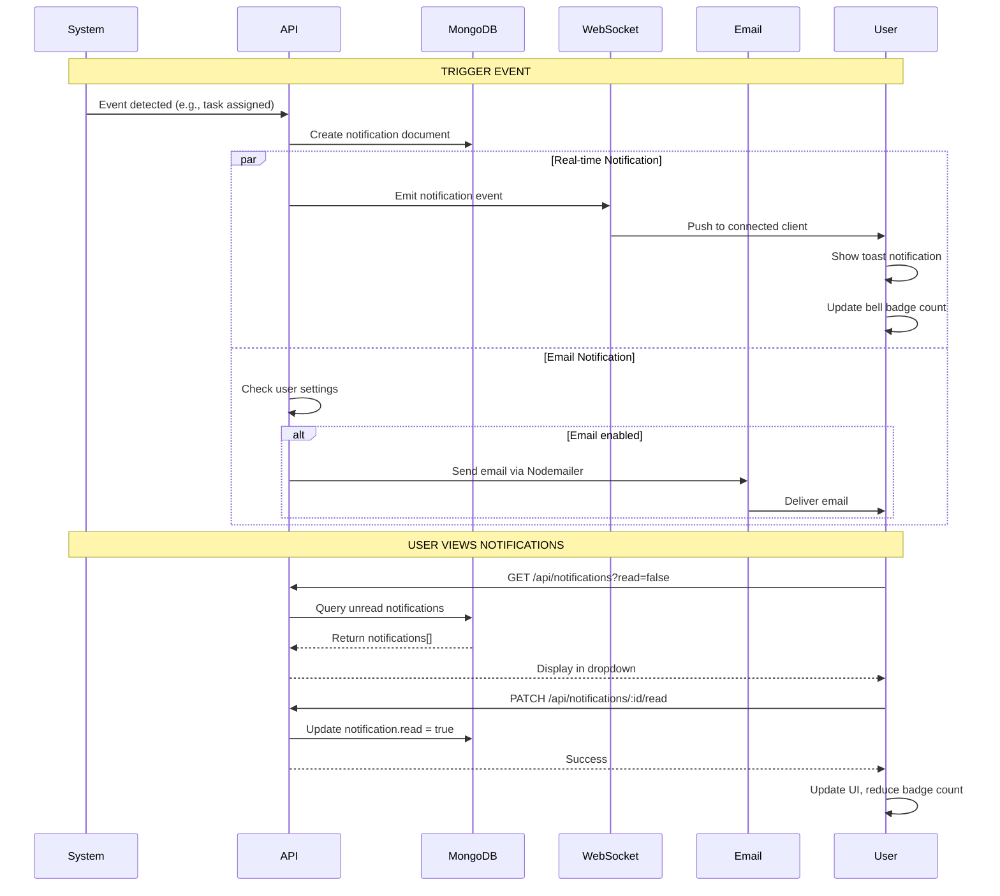
```mermaid
sequenceDiagram
    participant System
    participant API
    participant MongoDB
    participant WebSocket
    participant Email
    participant User
    
    Note over System,User: TRIGGER EVENT
    System->>API: Event detected (e.g., task assigned)
    API->>MongoDB: Create notification document
    
    par Real-time Notification
        API->>WebSocket: Emit notification event
        WebSocket->>User: Push to connected client
        User->>User: Show toast notification
        User->>User: Update bell badge count
    and Email Notification
        API->>API: Check user settings
        alt Email enabled
            API->>Email: Send email via Nodemailer
            Email->>User: Deliver email
        end
    end
    
    Note over System,User: USER VIEWS NOTIFICATIONS
    User->>API: GET /api/notifications?read=false
    API->>MongoDB: Query unread notifications
    MongoDB-->>API: Return notifications[]
    API-->>User: Display in dropdown
    
    User->>API: PATCH /api/notifications/:id/read
    API->>MongoDB: Update notification.read = true
    API-->>User: Success
    User->>User: Update UI, reduce badge count
```

### Hình 3.14. Sơ đồ tuần tự - Search và Filter

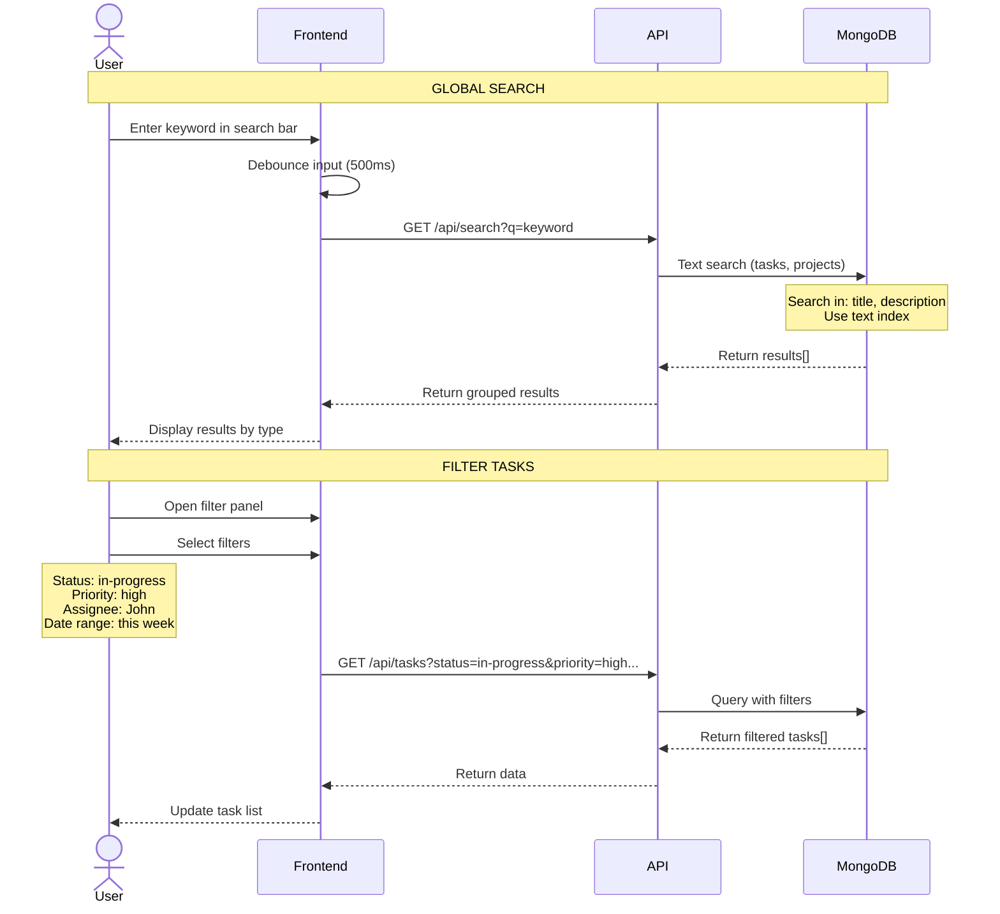
```mermaid
sequenceDiagram
    actor User
    participant Frontend
    participant API
    participant MongoDB
    
    Note over User,MongoDB: GLOBAL SEARCH
    User->>Frontend: Enter keyword in search bar
    Frontend->>Frontend: Debounce input (500ms)
    Frontend->>API: GET /api/search?q=keyword
    API->>MongoDB: Text search (tasks, projects)
    Note over MongoDB: Search in: title, description<br/>Use text index
    MongoDB-->>API: Return results[]
    API-->>Frontend: Return grouped results
    Frontend-->>User: Display results by type
    
    Note over User,MongoDB: FILTER TASKS
    User->>Frontend: Open filter panel
    User->>Frontend: Select filters
    Note over User: Status: in-progress<br/>Priority: high<br/>Assignee: John<br/>Date range: this week
    Frontend->>API: GET /api/tasks?status=in-progress&priority=high...
    API->>MongoDB: Query with filters
    MongoDB-->>API: Return filtered tasks[]
    API-->>Frontend: Return data
    Frontend-->>User: Update task list
```

### Hình 3.15. Sơ đồ tuần tự - Admin quản lý Users

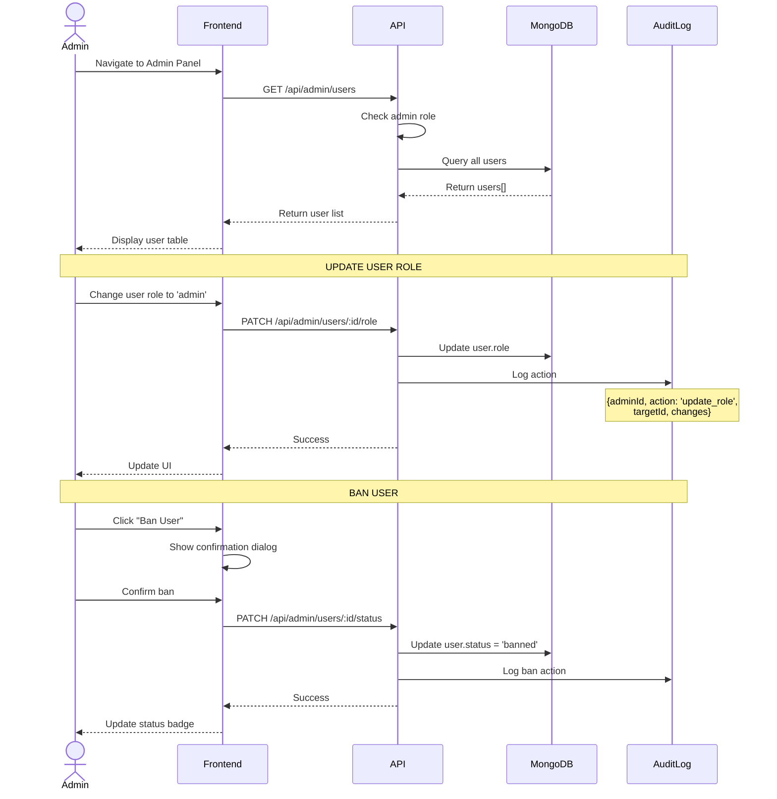
```mermaid
sequenceDiagram
    actor Admin
    participant Frontend
    participant API
    participant MongoDB
    participant AuditLog
    
    Admin->>Frontend: Navigate to Admin Panel
    Frontend->>API: GET /api/admin/users
    API->>API: Check admin role
    API->>MongoDB: Query all users
    MongoDB-->>API: Return users[]
    API-->>Frontend: Return user list
    Frontend-->>Admin: Display user table
    
    Note over Admin,AuditLog: UPDATE USER ROLE
    Admin->>Frontend: Change user role to 'admin'
    Frontend->>API: PATCH /api/admin/users/:id/role
    API->>MongoDB: Update user.role
    API->>AuditLog: Log action
    Note over AuditLog: {adminId, action: 'update_role',<br/>targetId, changes}
    API-->>Frontend: Success
    Frontend-->>Admin: Update UI
    
    Note over Admin,AuditLog: BAN USER
    Admin->>Frontend: Click "Ban User"
    Frontend->>Frontend: Show confirmation dialog
    Admin->>Frontend: Confirm ban
    Frontend->>API: PATCH /api/admin/users/:id/status
    API->>MongoDB: Update user.status = 'banned'
    API->>AuditLog: Log ban action
    API-->>Frontend: Success
    Frontend-->>Admin: Update status badge
```

### Hình 3.16. Sơ đồ tuần tự - Xử lý Reports

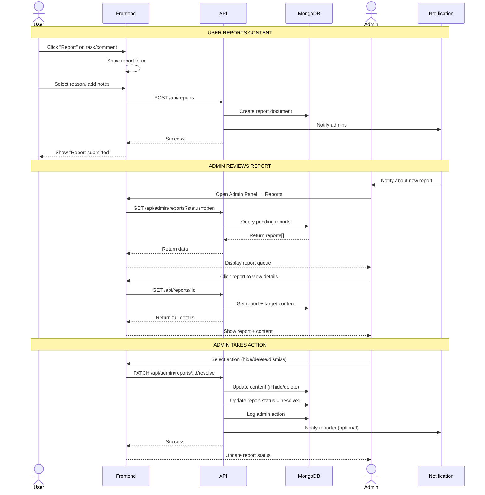
```mermaid
sequenceDiagram
    actor User
    participant Frontend
    participant API
    participant MongoDB
    actor Admin
    participant Notification
    
    Note over User,Notification: USER REPORTS CONTENT
    User->>Frontend: Click "Report" on task/comment
    Frontend->>Frontend: Show report form
    User->>Frontend: Select reason, add notes
    Frontend->>API: POST /api/reports
    API->>MongoDB: Create report document
    API->>Notification: Notify admins
    API-->>Frontend: Success
    Frontend-->>User: Show "Report submitted"
    
    Note over User,Notification: ADMIN REVIEWS REPORT
    Notification->>Admin: Notify about new report
    Admin->>Frontend: Open Admin Panel → Reports
    Frontend->>API: GET /api/admin/reports?status=open
    API->>MongoDB: Query pending reports
    MongoDB-->>API: Return reports[]
    API-->>Frontend: Return data
    Frontend-->>Admin: Display report queue
    
    Admin->>Frontend: Click report to view details
    Frontend->>API: GET /api/reports/:id
    API->>MongoDB: Get report + target content
    API-->>Frontend: Return full details
    Frontend-->>Admin: Show report + content
    
    Note over User,Notification: ADMIN TAKES ACTION
    Admin->>Frontend: Select action (hide/delete/dismiss)
    Frontend->>API: PATCH /api/admin/reports/:id/resolve
    API->>MongoDB: Update content (if hide/delete)
    API->>MongoDB: Update report.status = 'resolved'
    API->>MongoDB: Log admin action
    API->>Notification: Notify reporter (optional)
    API-->>Frontend: Success
    Frontend-->>Admin: Update report status
```

### Hình 3.17. Sơ đồ tuần tự - Upload Files

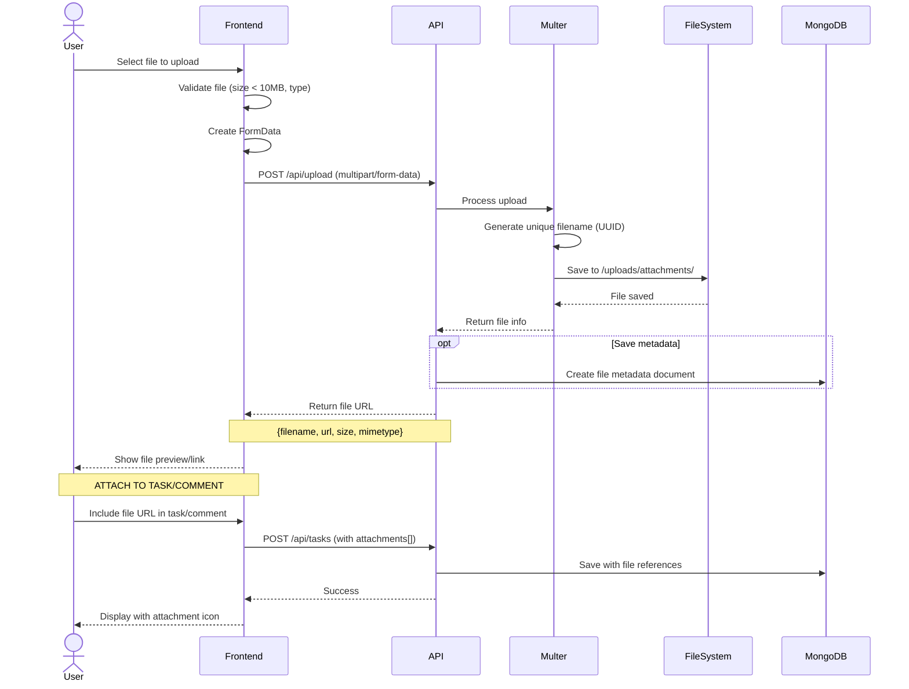
```mermaid
sequenceDiagram
    actor User
    participant Frontend
    participant API
    participant Multer
    participant FileSystem
    participant MongoDB
    
    User->>Frontend: Select file to upload
    Frontend->>Frontend: Validate file (size < 10MB, type)
    Frontend->>Frontend: Create FormData
    Frontend->>API: POST /api/upload (multipart/form-data)
    API->>Multer: Process upload
    Multer->>Multer: Generate unique filename (UUID)
    Multer->>FileSystem: Save to /uploads/attachments/
    FileSystem-->>Multer: File saved
    Multer-->>API: Return file info
    
    opt Save metadata
        API->>MongoDB: Create file metadata document
    end
    
    API-->>Frontend: Return file URL
    Note over API,Frontend: {filename, url, size, mimetype}
    Frontend-->>User: Show file preview/link
    
    Note over User,Frontend: ATTACH TO TASK/COMMENT
    User->>Frontend: Include file URL in task/comment
    Frontend->>API: POST /api/tasks (with attachments[])
    API->>MongoDB: Save with file references
    API-->>Frontend: Success
    Frontend-->>User: Display with attachment icon
```

### Hình 3.18. Sơ đồ tuần tự - Export to Excel

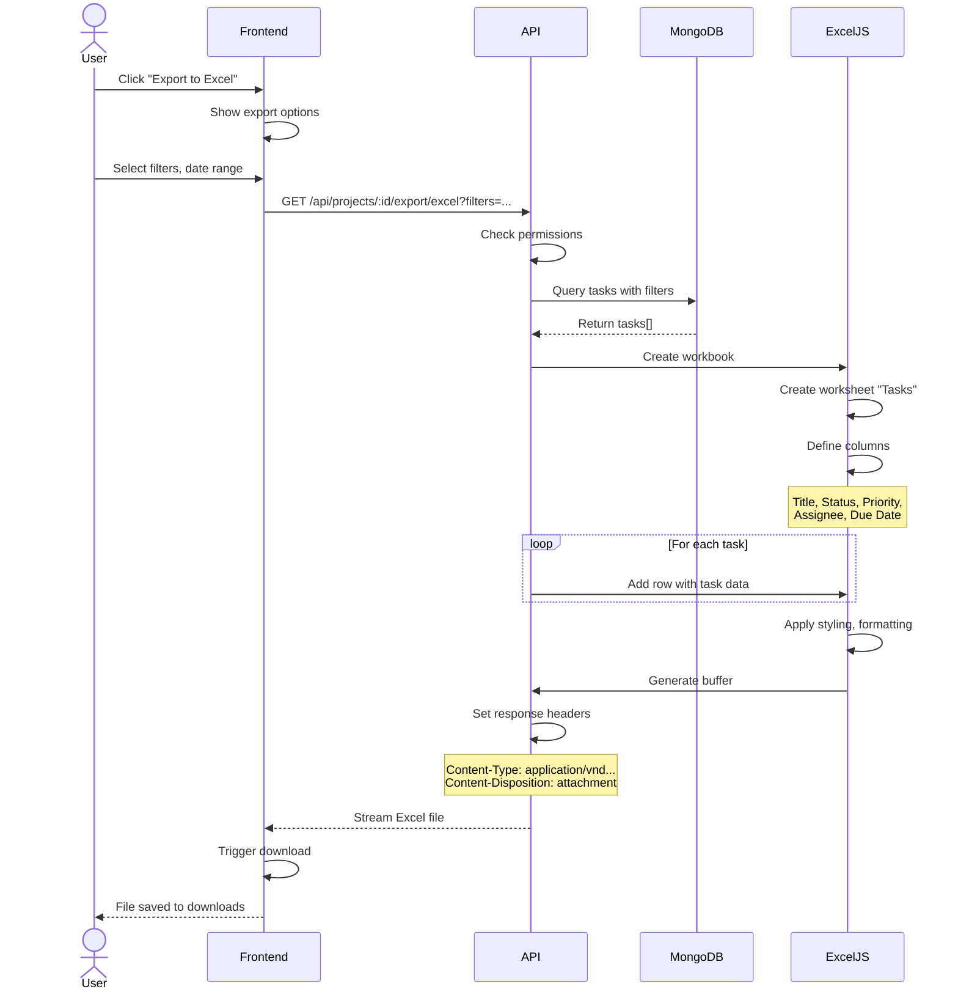
```mermaid
sequenceDiagram
    actor User
    participant Frontend
    participant API
    participant MongoDB
    participant ExcelJS
    
    User->>Frontend: Click "Export to Excel"
    Frontend->>Frontend: Show export options
    User->>Frontend: Select filters, date range
    Frontend->>API: GET /api/projects/:id/export/excel?filters=...
    API->>API: Check permissions
    API->>MongoDB: Query tasks with filters
    MongoDB-->>API: Return tasks[]
    
    API->>ExcelJS: Create workbook
    ExcelJS->>ExcelJS: Create worksheet "Tasks"
    ExcelJS->>ExcelJS: Define columns
    Note over ExcelJS: Title, Status, Priority,<br/>Assignee, Due Date
    
    loop For each task
        API->>ExcelJS: Add row with task data
    end
    
    ExcelJS->>ExcelJS: Apply styling, formatting
    ExcelJS->>API: Generate buffer
    API->>API: Set response headers
    Note over API: Content-Type: application/vnd...<br/>Content-Disposition: attachment
    API-->>Frontend: Stream Excel file
    Frontend->>Frontend: Trigger download
    Frontend-->>User: File saved to downloads
```

## 3. CLASS DIAGRAM

### Hình 3.20. Biểu đồ lớp của hệ thống

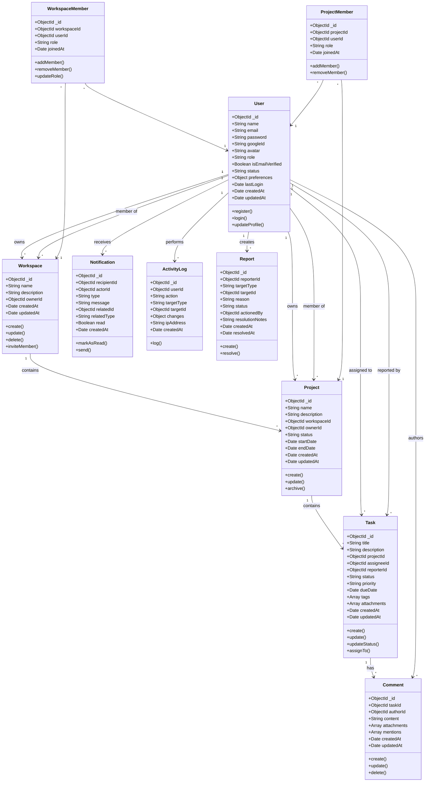
```mermaid
classDiagram
    class User {
        +ObjectId _id
        +String name
        +String email
        +String password
        +String googleId
        +String avatar
        +String role
        +Boolean isEmailVerified
        +String status
        +Object preferences
        +Date lastLogin
        +Date createdAt
        +Date updatedAt
        +register()
        +login()
        +updateProfile()
    }
    
    class Workspace {
        +ObjectId _id
        +String name
        +String description
        +ObjectId ownerId
        +Date createdAt
        +Date updatedAt
        +create()
        +update()
        +delete()
        +inviteMember()
    }
    
    class WorkspaceMember {
        +ObjectId _id
        +ObjectId workspaceId
        +ObjectId userId
        +String role
        +Date joinedAt
        +addMember()
        +removeMember()
        +updateRole()
    }
    
    class Project {
        +ObjectId _id
        +String name
        +String description
        +ObjectId workspaceId
        +ObjectId ownerId
        +String status
        +Date startDate
        +Date endDate
        +Date createdAt
        +Date updatedAt
        +create()
        +update()
        +archive()
    }
    
    class ProjectMember {
        +ObjectId _id
        +ObjectId projectId
        +ObjectId userId
        +String role
        +Date joinedAt
        +addMember()
        +removeMember()
    }
    
    class Task {
        +ObjectId _id
        +String title
        +String description
        +ObjectId projectId
        +ObjectId assigneeId
        +ObjectId reporterId
        +String status
        +String priority
        +Date dueDate
        +Array tags
        +Array attachments
        +Date createdAt
        +Date updatedAt
        +create()
        +update()
        +updateStatus()
        +assignTo()
    }
    
    class Comment {
        +ObjectId _id
        +ObjectId taskId
        +ObjectId authorId
        +String content
        +Array attachments
        +Array mentions
        +Date createdAt
        +Date updatedAt
        +create()
        +update()
        +delete()
    }
    
    class Notification {
        +ObjectId _id
        +ObjectId recipientId
        +ObjectId actorId
        +String type
        +String message
        +ObjectId relatedId
        +String relatedType
        +Boolean read
        +Date createdAt
        +markAsRead()
        +send()
    }
    
    class ActivityLog {
        +ObjectId _id
        +ObjectId userId
        +String action
        +String targetType
        +ObjectId targetId
        +Object changes
        +String ipAddress
        +Date createdAt
        +log()
    }
    
    class Report {
        +ObjectId _id
        +ObjectId reporterId
        +String targetType
        +ObjectId targetId
        +String reason
        +String status
        +ObjectId actionedBy
        +String resolutionNotes
        +Date createdAt
        +Date resolvedAt
        +create()
        +resolve()
    }
    
    %% Relationships
    User "1" --> "*" Workspace : owns
    User "*" --> "*" Workspace : member of
    WorkspaceMember "*" --> "1" User
    WorkspaceMember "*" --> "1" Workspace
    
    Workspace "1" --> "*" Project : contains
    User "1" --> "*" Project : owns
    User "*" --> "*" Project : member of
    ProjectMember "*" --> "1" User
    ProjectMember "*" --> "1" Project
    
    Project "1" --> "*" Task : contains
    User "1" --> "*" Task : assigned to
    User "1" --> "*" Task : reported by
    
    Task "1" --> "*" Comment : has
    User "1" --> "*" Comment : authors
    
    User "1" --> "*" Notification : receives
    User "1" --> "*" ActivityLog : performs
    User "1" --> "*" Report : creates
```

## 4. ENTITY RELATIONSHIP DIAGRAM (ERD)

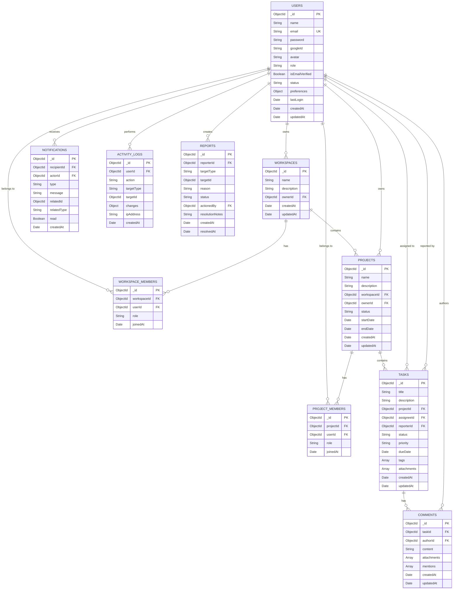
```mermaid
erDiagram
    USERS ||--o{ WORKSPACES : owns
    USERS ||--o{ WORKSPACE_MEMBERS : "belongs to"
    WORKSPACES ||--o{ WORKSPACE_MEMBERS : has
    
    WORKSPACES ||--o{ PROJECTS : contains
    USERS ||--o{ PROJECTS : owns
    USERS ||--o{ PROJECT_MEMBERS : "belongs to"
    PROJECTS ||--o{ PROJECT_MEMBERS : has
    
    PROJECTS ||--o{ TASKS : contains
    USERS ||--o{ TASKS : "assigned to"
    USERS ||--o{ TASKS : "reported by"
    
    TASKS ||--o{ COMMENTS : has
    USERS ||--o{ COMMENTS : authors
    
    USERS ||--o{ NOTIFICATIONS : receives
    USERS ||--o{ ACTIVITY_LOGS : performs
    USERS ||--o{ REPORTS : creates
    
    USERS {
        ObjectId _id PK
        String name
        String email UK
        String password
        String googleId
        String avatar
        String role
        Boolean isEmailVerified
        String status
        Object preferences
        Date lastLogin
        Date createdAt
        Date updatedAt
    }
    
    WORKSPACES {
        ObjectId _id PK
        String name
        String description
        ObjectId ownerId FK
        Date createdAt
        Date updatedAt
    }
    
    WORKSPACE_MEMBERS {
        ObjectId _id PK
        ObjectId workspaceId FK
        ObjectId userId FK
        String role
        Date joinedAt
    }
    
    PROJECTS {
        ObjectId _id PK
        String name
        String description
        ObjectId workspaceId FK
        ObjectId ownerId FK
        String status
        Date startDate
        Date endDate
        Date createdAt
        Date updatedAt
    }
    
    PROJECT_MEMBERS {
        ObjectId _id PK
        ObjectId projectId FK
        ObjectId userId FK
        String role
        Date joinedAt
    }
    
    TASKS {
        ObjectId _id PK
        String title
        String description
        ObjectId projectId FK
        ObjectId assigneeId FK
        ObjectId reporterId FK
        String status
        String priority
        Date dueDate
        Array tags
        Array attachments
        Date createdAt
        Date updatedAt
    }
    
    COMMENTS {
        ObjectId _id PK
        ObjectId taskId FK
        ObjectId authorId FK
        String content
        Array attachments
        Array mentions
        Date createdAt
        Date updatedAt
    }
    
    NOTIFICATIONS {
        ObjectId _id PK
        ObjectId recipientId FK
        ObjectId actorId FK
        String type
        String message
        ObjectId relatedId
        String relatedType
        Boolean read
        Date createdAt
    }
    
    ACTIVITY_LOGS {
        ObjectId _id PK
        ObjectId userId FK
        String action
        String targetType
        ObjectId targetId
        Object changes
        String ipAddress
        Date createdAt
    }
    
    REPORTS {
        ObjectId _id PK
        ObjectId reporterId FK
        String targetType
        ObjectId targetId
        String reason
        String status
        ObjectId actionedBy FK
        String resolutionNotes
        Date createdAt
        Date resolvedAt
    }
```

## 5. FLOWCHART - Luồng tạo Task với AI

```mermaid
flowchart TD
    Start([User opens Create Task]) --> Input[Enter task details]
    Input --> Question{Use AI Analysis?}
    
    Question -->|Yes| CallAI[Call Gemini AI API]
    CallAI --> AIProcess[AI analyzes description]
    AIProcess --> AIReturn[Return suggestions:<br/>- Subtasks<br/>- Priority<br/>- Estimated time]
    AIReturn --> ShowSuggestion[Display suggestions to user]
    
    ShowSuggestion --> AcceptAI{Accept suggestions?}
    AcceptAI -->|Yes| ApplySuggestion[Apply AI suggestions]
    AcceptAI -->|No| ManualInput
    
    Question -->|No| ManualInput[Manual input all fields]
    
    ApplySuggestion --> Validate
    ManualInput --> Validate[Validate form data]
    
    Validate --> ValidCheck{Valid?}
    ValidCheck -->|No| Error[Show validation errors]
    Error --> Input
    
    ValidCheck -->|Yes| UploadFiles{Has attachments?}
    UploadFiles -->|Yes| Upload[Upload files to server]
    Upload --> SaveTask
    UploadFiles -->|No| SaveTask[Save task to MongoDB]
    
    SaveTask --> Notify[Send notification to assignee]
    Notify --> ActivityLog[Log activity]
    ActivityLog --> End([Task created successfully])
```

## 6. STATE DIAGRAM - Task Status Flow

```mermaid
stateDiagram-v2
    [*] --> Todo: Create Task
    
    Todo --> InProgress: Start Working
    Todo --> Cancelled: Cancel Task
    
    InProgress --> Review: Submit for Review
    InProgress --> Todo: Move Back
    InProgress --> Cancelled: Cancel
    
    Review --> Done: Approve
    Review --> InProgress: Request Changes
    Review --> Todo: Reject
    
    Done --> [*]
    Cancelled --> [*]
    
    note right of Todo
        Initial state
        Waiting to start
    end note
    
    note right of InProgress
        Actively being worked on
        Can be reassigned
    end note
    
    note right of Review
        Awaiting approval
        Can comment
    end note
    
    note right of Done
        Completed
        Cannot modify
    end note
```

## 7. COMPONENT DIAGRAM - System Architecture

```mermaid
graph TB
    subgraph "Client Side"
        Browser[Web Browser]
        React[React App<br/>Vite + React 18]
        Redux[Redux Store<br/>State Management]
        UI[UI Components<br/>Tailwind CSS]
    end
    
    subgraph "Server Side"
        Express[Express Server<br/>Node.js]
        Auth[Auth Middleware<br/>JWT Verification]
        Routes[API Routes]
        Controllers[Controllers<br/>Business Logic]
        Middleware[Middleware<br/>Validation, Permissions]
    end
    
    subgraph "Database"
        MongoDB[(MongoDB<br/>NoSQL Database)]
    end
    
    subgraph "External Services"
        Gemini[Google Gemini AI<br/>Task Analysis]
        Email[Nodemailer<br/>Email Service]
        OAuth[Google OAuth 2.0<br/>Authentication]
    end
    
    subgraph "File Storage"
        FileSystem[Local File System<br/>/uploads/attachments]
    end
    
    Browser --> React
    React --> Redux
    React --> UI
    
    React <-->|HTTP/REST API| Express
    Express --> Auth
    Auth --> Routes
    Routes --> Controllers
    Controllers --> Middleware
    Controllers <--> MongoDB
    
    Controllers --> Gemini
    Controllers --> Email
    Express --> OAuth
    Controllers --> FileSystem
    
    style React fill:#61dafb
    style Express fill:#68a063
    style MongoDB fill:#4db33d
    style Gemini fill:#4285f4
```

---

## HƯỚNG DẪN SỬ DỤNG

### Cách render Mermaid diagrams:

1. **Trong Markdown viewers** (GitHub, GitLab, VS Code với extension):
   - Các diagram sẽ tự động render

2. **Trong VS Code**:
   - Cài extension "Markdown Preview Mermaid Support"
   - Mở file .md và click "Open Preview"

3. **Online tools**:
   - https://mermaid.live/ - Paste code và xem real-time
   - https://mermaid-js.github.io/mermaid-live-editor/

4. **Export to image**:
   - Từ mermaid.live, click "Actions" → "PNG/SVG"
   - Hoặc dùng mermaid-cli: `mmdc -i input.mmd -o output.png`

### Tùy chỉnh theme:

Thêm vào đầu file markdown:
```markdown
%%{init: {'theme':'base', 'themeVariables': { 'primaryColor':'#4285f4'}}}%%
```

### Tips:
- Sequence diagrams tốt nhất cho luồng tương tác
- Class diagrams cho cấu trúc dữ liệu
- Flowcharts cho quy trình ra quyết định
- State diagrams cho lifecycle của entities
